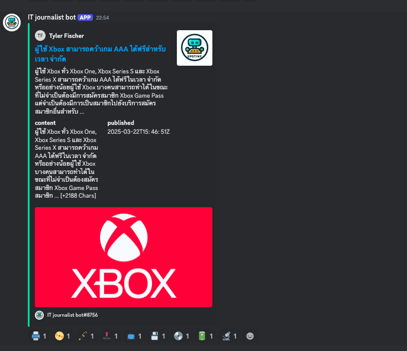

<div align="center">

[](https://github.com/watchakorn-18k/bot-news-it-discord/actions/workflows/run_bot.yml)

</div>

# bot-news-it-discord

<p align="center">

</p>

# .env

```.env
TOKEN= <TOKEN_BOT>
API_NEWS= <API newsapi.org>
```

## Description

📑 Bot updates news about IT and programming with Update every hour

## Getting Started

```
fenv clone https://github.com/<User Name Github>/bot-news-it-discord.git

cd bot-news-it-discord

```

## Installation

```
cd bot-news-it-discord

# create virtualenv auto name
fenv onlyenv

# install package in requirements.txt
fenv install

```

## Usage

[📑 INVITE BOT TO YOUR SERVER](https://discord.com/api/oauth2/authorize?client_id=1100078503946358915&permissions=2199023987904&scope=bot)

## Tree

<!--- Start Tree --->

```bash
.
└── bot-news-it-discord/
        └──.git/
        └──.github/
        └──.vscode/
                └──settings.json
        └──env_bot-news-it-discord/
                └── Lib/
                └── Scripts
                └── .gitignore
                └── pyvenv.cfg
        └──__pycache__/
        └──.env
        └──.gitignore
        └──.tmp
        └──main.py
        └──news.py
        └──readme.md
        └──requirements.txt

```

<!--- End Tree --->

## Change Log

- add translate with google translate in main.py

```py
def translater(func):
        def wrapper(*args):

                return translator.translate(func(*args), dest="th").text
                """
                "th" can change your local language 👆🏻
                """
        return wrapper

```

## Contributing

If you would like to contribute to the project, include a section on how to do so, including any guidelines and best practices.